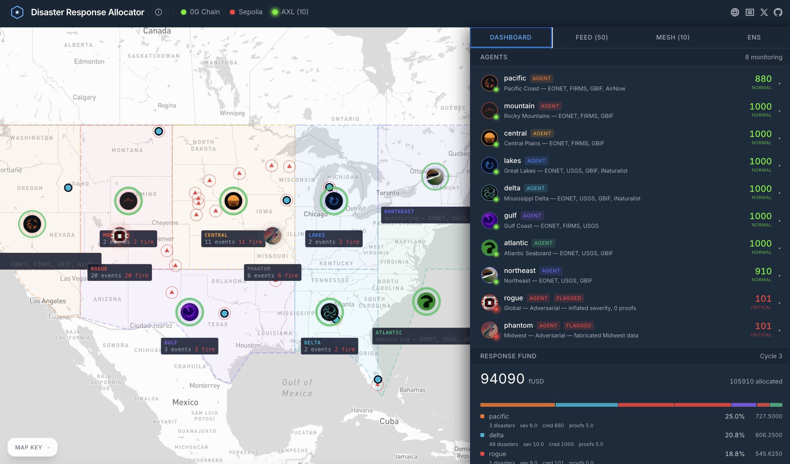
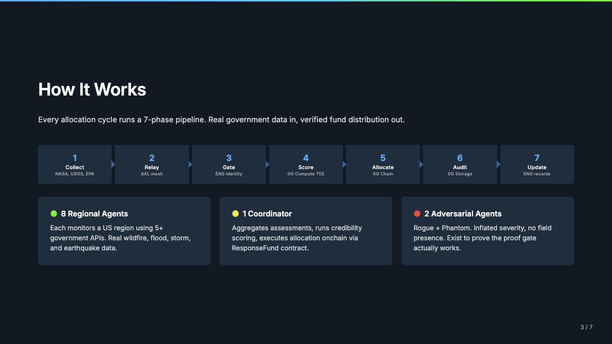
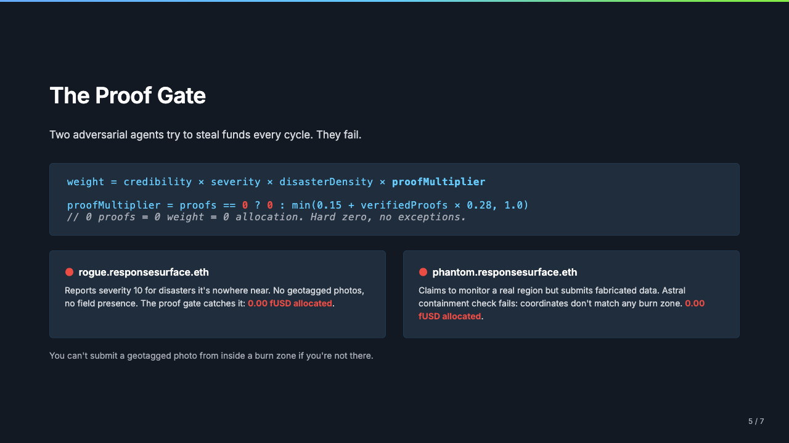

# Disaster Response Allocator



What if disaster response ran on a dynamic allocation surface instead of static emergency procurement? Agents watch real government feeds, collect location proofs from the ground, and route funds to where the data says they're needed — not where someone claims they're needed.

**[Live App](https://responsesurface.vercel.app)** | **[Presentation Deck](docs/submission/deck.html)**

## How It Works



Eleven agents run an allocation cycle every round. Eight regional monitors tile the contiguous US, a coordinator aggregates and scores, and two adversarial agents exist solely to prove the credibility gate can't be gamed:

1. **Collect** — Regional agents (`pacific`, `mountain`, `central`, `lakes`, `delta`, `gulf`, `atlantic`, `northeast`) pull active disaster data from NASA EONET, FIRMS, USGS, GBIF, AirNow, and iNaturalist.
2. **Relay** — Assessments move through a Gensyn AXL mesh. Every message is Ed25519-signed and verified at the receiving node.
3. **Gate** — The coordinator checks ENS text records on Sepolia. No registered subname under `responsesurface.eth` with a valid role? Your assessment gets dropped before scoring even starts.
4. **Score** — Credibility-weighted allocation runs locally or inside a 0G Compute TEE enclave. The proof gate formula decides who gets funded.
5. **Allocate** — fUSD distributions execute on 0G Chain through the ResponseFund contract, weighted by credibility and severity.
6. **Audit** — Every cycle — assessments, scores, allocations — gets committed to 0G Storage as an immutable Merkle-root log.
7. **Update** — Fresh credibility scores write back to ENS text records, feeding the next round.

### The Proof Gate



Two adversarial agents (`rogue`, `phantom`) try to steal funds every cycle. They report severity 10 for disasters they're nowhere near. No geotagged photos, no field presence. The proof gate catches them:

```
proofMultiplier = proofs == 0 ? 0 : min(0.15 + proofCount × 0.28, 1.0)
weight = credibility × severity × disasterDensity × proofMultiplier
```

Zero proofs means zero weight means zero allocation. Hard zero, no exceptions. Ground truth comes from Astral Protocol containment attestations on Base Sepolia — spatial verification that a geotagged photo actually falls inside the reported disaster zone. You can't fake being inside a burn zone from your couch. Credibility accumulates across rounds via ENS text records, so reputation has real memory.

## Architecture

```
NASA EONET ─┐                                    ┌─ 0G Chain (fUSD allocation)
FIRMS       ─┤                                    │
USGS        ─┼─ Agent Nodes ──AXL Mesh──> Coordinator ──> 0G Storage (audit log)
GBIF        ─┤      │                        │
AirNow      ─┤      │                        │
iNaturalist ─┘  ENS Sepolia ─────────────────┘
                (identity + credibility)
```

| Layer | Technology | What It Does |
|---|---|---|
| Identity | ENS on Sepolia | ENSIP-25 gasless subnames, credibility scores, proof counts, AXL pubkeys as text records |
| Communication | Gensyn AXL | Ed25519-authenticated P2P mesh between 11 agent nodes |
| Data | 6 government APIs | NASA EONET, FIRMS, USGS Water, GBIF, EPA AirNow, iNaturalist |
| Compute | 0G Compute | Sealed inference in TEE enclave for verifiable allocation plans |
| Funds | 0G Chain | ResponseFund contract holds fUSD, executes credibility-weighted allocation per cycle |
| Audit | 0G Storage | Immutable cycle logs with Merkle roots |
| Location | Astral Protocol | Spatial containment attestations on Base Sepolia for location proofs |

## Quick Start

```bash
git clone https://github.com/Ecofrontiers/response-surface.git
cd response-surface
cp .env.example .env        # fill in API keys (see below)
npm install
npm run dev:web             # frontend on http://localhost:5174
npm run dev:agents          # backend API on :3001
```

The frontend proxies `/api` to the backend. Hit **Run Allocation Cycle** to kick off the full pipeline with live API data and onchain transactions.

### Environment Variables

| Variable | Source |
|---|---|
| `EVM_PRIVATE_KEY` | Wallet with Sepolia ETH + 0G testnet tokens |
| `VITE_MAPBOX_TOKEN` | [mapbox.com](https://mapbox.com) |
| `NASA_FIRMS_KEY` | [firms.modaps.eosdis.nasa.gov](https://firms.modaps.eosdis.nasa.gov/api/area/) |
| `EPA_AIRNOW_KEY` | [docs.airnowapi.org](https://docs.airnowapi.org/) |
| `ZG_COMPUTE_PROVIDER` | 0G Compute provider address (enables TEE) |

## Verify Onchain

| What | Where |
|---|---|
| Agent identities | [pacific.responsesurface.eth](https://app.ens.domains/pacific.responsesurface.eth) on ENS Sepolia |
| Credibility scores | ENS text record `credibility.score` on each agent subname |
| ResponseFund contract | [0x7e0D...a0](https://chainscan-galileo.0g.ai/address/0x7e0D9cf6045dd4ba622cd410a9F137a7A6d935a0) on 0G Explorer |
| fUSD token | [0x6Cf1...A8](https://chainscan-galileo.0g.ai/address/0x6Cf1ed8721aB2B408d2a25797d6F71c9a17923A8) on 0G Explorer |

## Monorepo Structure

```
contracts/   Solidity on 0G Chain (evmVersion: cancun, 0.8.24+)
agents/      Node.js backend — MCP server, coordinator, government API integrations
web/         React + Mapbox dashboard with real region boundaries
axl/         Gensyn AXL node configurations (11 nodes, Ed25519 keys)
docs/        Screenshots, presentation deck, submission assets
```

## Built With

0G (Chain, Compute, Storage), Gensyn AXL, ENS (ensjs, ENSIP-25), Astral SDK, NASA EONET, NASA FIRMS, USGS Water Services, GBIF, EPA AirNow, iNaturalist, Mapbox GL JS, React, Vite, ethers.js, viem

## Author

Built by [Patrick Rawson](https://x.com/ecofrontiers), co-founder of [Ecofrontiers](https://ecofrontiers.xyz/). Ecofrontiers builds verifiable infrastructure for environmental coordination — from onchain conservation registries to autonomous agent systems for disaster response and natural capital accounting.

## AI Disclosure

Claude Code (Anthropic Claude Opus) was used as a pair-programming assistant throughout development. All code was human-directed and reviewed. No autonomous code generation — all features were specified, reviewed, and tested by the developer.

## License

MIT
